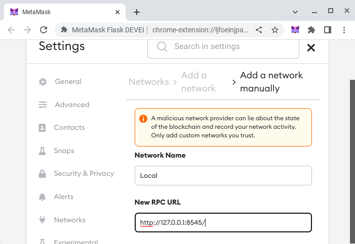
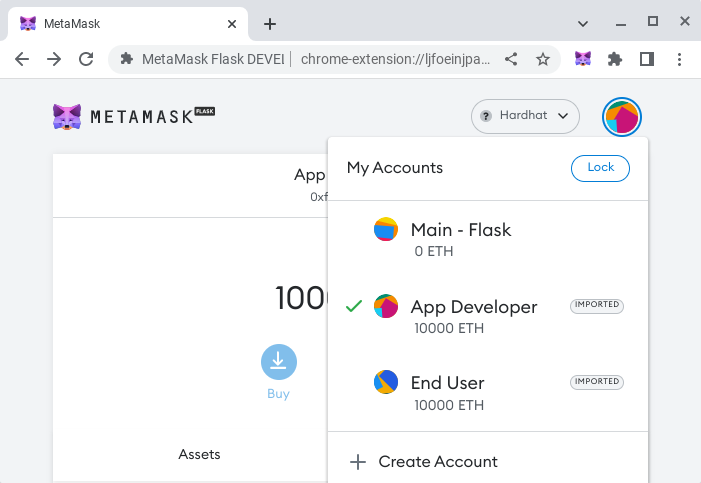
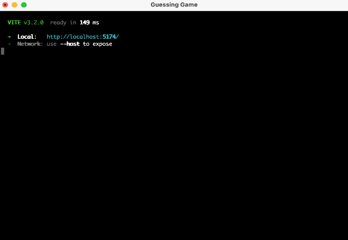
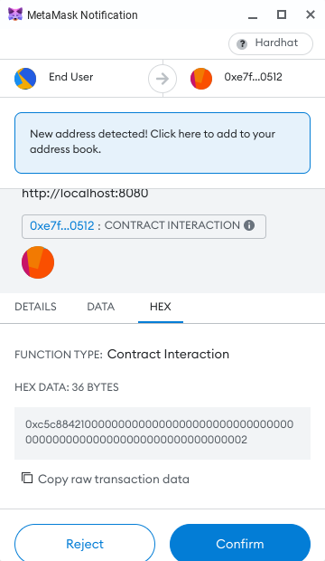
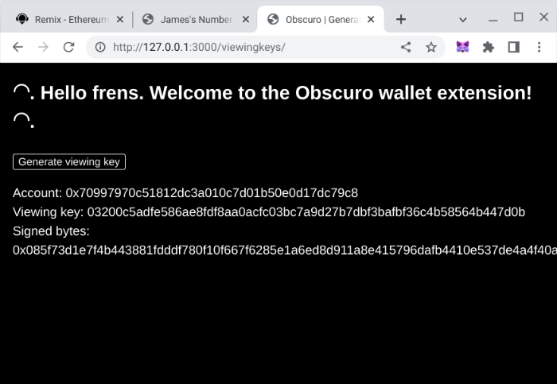

# Basic Sample Obscuro Project

## Introduction
This project demonstrates a basic Obscuro use case, which is a simple number guessing game. The contract generates a 
random secret number when it's deployed, which is never revealed to an operator or end-user because of the privacy 
benefits of Obscuro. The goal of the game is to guess this number, and each time an attempt is made, an entrance fee of 
1 token is paid. If a user correctly guesses the number, the contract will pay out all of the accumulated entrance 
fees to them, and reset itself with a new random number.

Without Obscuro, it would be possible to look up the internal state of the contract and cheat, and the game wouldn't work. 

The contract functionality comes with two contracts; a basic ERC20 contract which allows the user to hold assets and 
pay the entrance fee to the game, and the game contract itself. This includes a test for that contract, a sample script 
hat deploys that contract, and an example of a task implementation, which simply lists the available accounts.

In developing this game, the following tools were used:
* Git (Source code versioning tool)
* NPM (Node Package Manager, available on many platforms)
* NPX (Node Package Execution, used as a runtime for Hardhat tasks)
* Hardhat (a complete Ethereum compiler and test deployment environment)
* Ethers.js (a Web3 Javascript library)
* Vite (a packaging library, handy for compiling Typescript)
* Metamask (a popular wallet for crypto tokens and smart contract interaction)
* Obscuro Testnet (an open, permissionless test network for Obscuro)
* Obscuro Wallet Extension (a proxy for an Obscuro node, which handles encryption for all data between the wallet and the network)

## Environment Setup
The following steps are required:
1. Clone this repository into a suitable folder.
2. Install NPM and NPX, and ensure they are running correctly. This is outside the scope of this project.
3. Install NPM packages specified in `package.json` by running:
```shell
npm install
npm install hardhat@esm
```
4. The contract is deployed initially to a Hardhat network. Hardhat and its dependencies will have been installed in 
the previous step. More details are available at https://hardhat.org/hardhat-runner/docs/getting-started#overview. 
Once Hardhat is installed, try running some of the following tasks:
```shell
npx hardhat compile
npx hardhat clean
npx hardhat test
npx hardhat help
```
5. Starting Hardhat with `npx hardhat node` will start a local hardhat network with the two accounts as specified in 
the [network config](./config/networks.json) file (note that these private keys are well-known!) and will deploy the 
ERC20 token and game contracts. You should take notice of the account and contract addresses for later. 


6. Set up Metamask with the Hardhat network on `http://127.0.0.1:8545/`. 



7. Import the accounts into Metamask using the private keys (only the end user account is required to be imported). 


8. Rename the accounts to be more user-friendly.



## Application Development
After starting the Hardhat network and deployment of the contracts, the game can be played be following the below steps;

1. Edit the [index.ts](./src/index.ts) file to ensure the correct contract addresses are being used. Once done, start 
the user interface for the game, ignoring warnings if possible.



2. The app is not initially connected to Metamask, and when the page first loads, it should prompt Metamask to pop up 
and seek connection wth the end-user account. You should approve this.


3. After connection, the user interface should now show the contract address, the range of the random number, and the 
number of guesses so far.


4. Approve the game for the number of guesses you want to perform, and have a go at guessing the number!



## Transitioning to Obscuro Testnet
Because Obscuro uses the same tools and EVM as Ethereum itself, it should be possible to replay the previous steps with 
Obscuro's Testnet.

1. Start up the wallet extension. Follow instructions at (docs.obscu.ro/testnet/wallet-extension)[https://docs.obscu.ro/testnet/wallet-extension.html]. 
The wallet extension is started with configuration to connect to Testnet, and to Metamask, it acts like the network itself. 


2. When a viewing key is requested, Metamask will ask for permission to connect to the wallet extension "network", and 
then request the user to sign a "generate viewing key" transaction.



3. Deploy the contracts to the Obscuro Testnet using `npx hardhat deploy --network obscuro`. Take a note of the contract
addresses from the console. 

4. Confirm and update the contract addresses `ERC20_ADDRESS` and `GUESS_ADDRESS` in [index.ts](./src/index.ts).

5. For this deployment, use a single user and account for deployment and game playing.

6. Start the user interface for the game, and click on the "Approve game fee" button to allow the Guess contract to take
the game entrance fee from the end-user's account. Metamask will ask for end-user account to sign a transaction to call 
the `approve` function, specifying the Guess contract address as the delegate.


12. Finally, have a go at guessing the number! Note how the data presented by Metamask to the user is not yet encypted: 
that happens when Metamask signs the transaction and sends it to the wallet extension "network", allowing the wallet 
extension to encrypt it.


